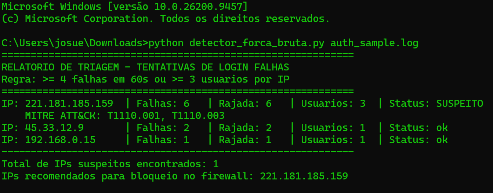

# SSH Brute Force Detector

A lightweight Python tool that analyzes SSH authentication logs, detects brute force and password spraying attempts, and generates a triage report with firewall block recommendations.

Built as a hands-on blue team / SOC analyst exercise: log parsing, detection logic, and MITRE ATT&CK mapping, using only the Python standard library.

## Features

- **Sliding time window:** flags an IP only when it fails N times within a short period, reducing false positives from typos spread over days.
- **Password spraying detection:** flags IPs that try many different usernames.
- **Success after attack:** escalates to **CRITICAL** when an IP logs in successfully after a suspicious burst of failures (possible compromise).
- **MITRE ATT&CK mapping:** each finding is tagged with its technique ID.
- **Triage report:** sorted by failure count, with a ready-to-use list of IPs to block.
- **Zero dependencies:** runs on Python 3.8+.

## Detection rules

| Rule | Default | Description |
|---|---|---|
| `LIMITE_FALHAS` | 4 | Failed logins within the time window to flag brute force |
| `JANELA_SEGUNDOS` | 60 | Size of the sliding window, in seconds |
| `LIMITE_USUARIOS` | 3 | Distinct usernames from one IP to flag password spraying |

An IP is **SUSPECT** if it triggers brute force or spraying. It becomes **CRITICAL** if it also has a successful login after at least `LIMITE_FALHAS` failures.

## MITRE ATT&CK mapping

| Technique | Name | Trigger |
|---|---|---|
| [T1110.001](https://attack.mitre.org/techniques/T1110/001/) | Brute Force: Password Guessing | Burst of failures in the time window |
| [T1110.003](https://attack.mitre.org/techniques/T1110/003/) | Brute Force: Password Spraying | Many usernames from one IP |

## Usage

```bash
python detector_forca_bruta.py auth_sample.log
```

Expected log format (standard `sshd` syslog):

```
Sep 30 18:10:01 server sshd[1021]: Failed password for root from 221.181.185.159 port 55210 ssh2
Sep 30 18:15:02 server sshd[1040]: Accepted password for josue from 192.168.0.15 port 51200 ssh2
```

On a real Linux server, the log is usually at `/var/log/auth.log` (Debian/Ubuntu) or `/var/log/secure` (RHEL/CentOS).

## Example output

```
============================================================
RELATORIO DE TRIAGEM - TENTATIVAS DE LOGIN FALHAS
Regra: >= 4 falhas em 60s ou >= 3 usuarios por IP
============================================================
IP: 221.181.185.159  | Falhas: 6   | Rajada: 6   | Usuarios: 3  | Status: SUSPEITO
    MITRE ATT&CK: T1110.001, T1110.003
IP: 45.33.12.9       | Falhas: 2   | Rajada: 2   | Usuarios: 1  | Status: ok
IP: 192.168.0.15     | Falhas: 1   | Rajada: 1   | Usuarios: 1  | Status: ok
------------------------------------------------------------
Total de IPs suspeitos encontrados: 1
IPs recomendados para bloqueio no firewall: 221.181.185.159
```



## Project structure

```
.
├── detector_forca_bruta.py   # detector
├── auth_sample.log           # sample log (synthetic data)
├── screenshot.png            # terminal output
└── README.md
```

## Limitations and roadmap

- Parses only `Failed password` / `Accepted password` lines (no `Invalid user`-only or public key events yet).
- Syslog timestamps have no year; the current year is assumed.
- IPv4 only.
- Planned: IPv6 support, CSV/JSON export, GeoIP enrichment, automatic `iptables`/`ufw` rule generation.

## Disclaimer

The sample log contains synthetic data. Use this tool only on systems and logs you are authorized to analyze. Review any IP before blocking it: shared networks and NAT can cause false positives.

## License

MIT
